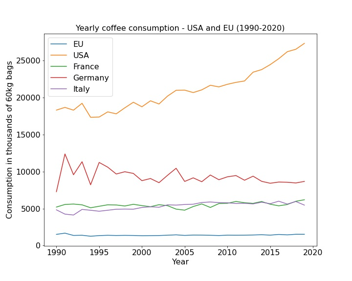
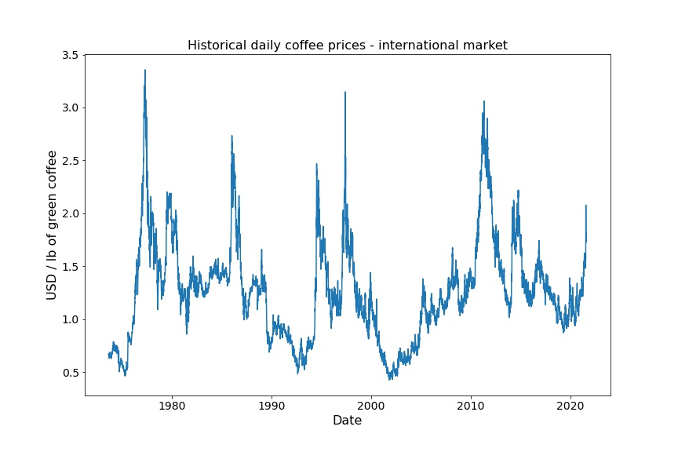
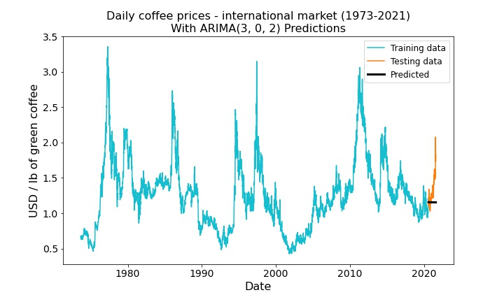
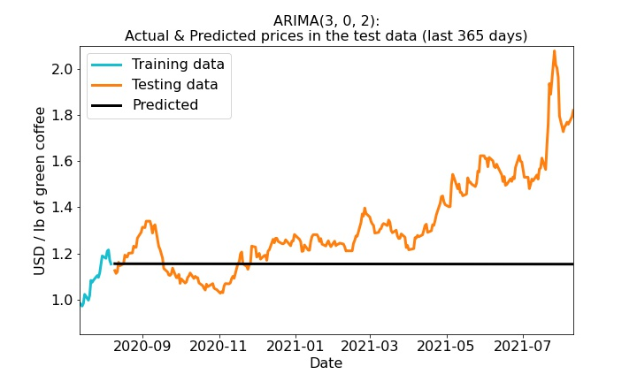
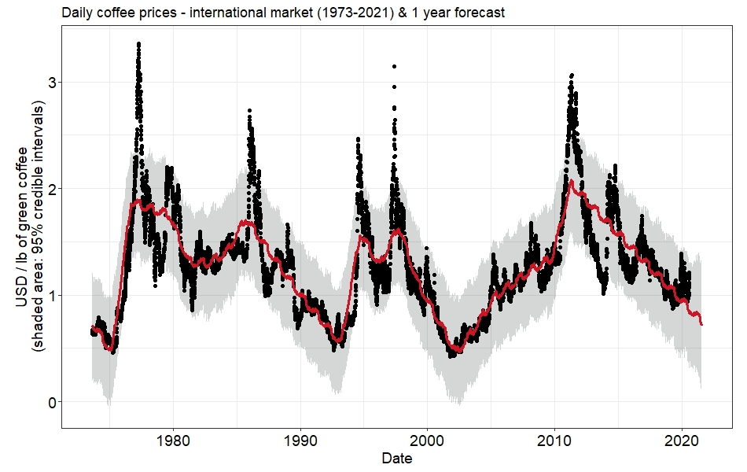
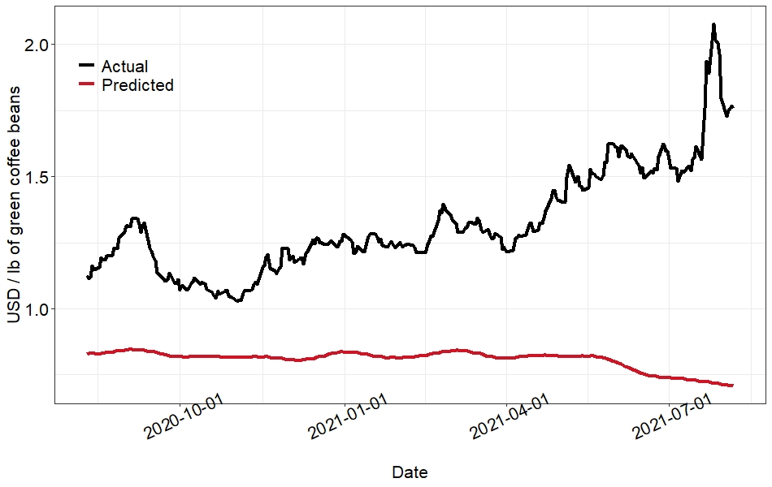
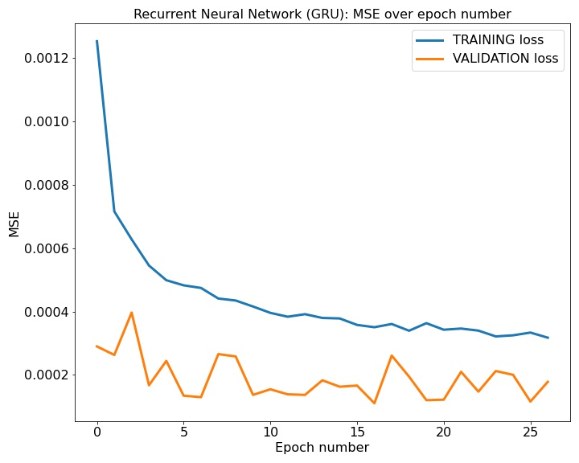
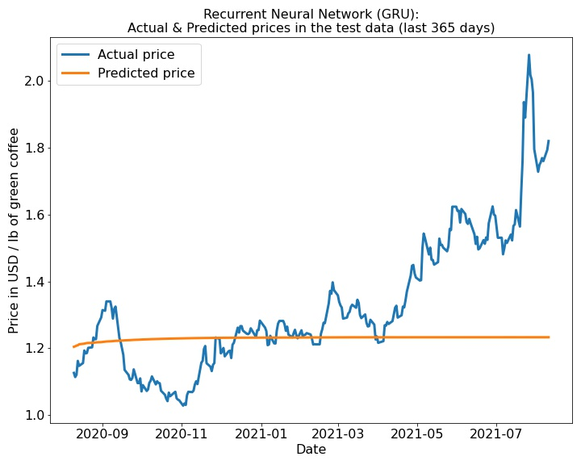

# Predicting Coffee Price - A Time Series Analysis

**Yair Haendler**

Generaly Assembly - Immersive Data Science program - May-August 2021 - capstone project

---

#### 📝 In short: Three Time Series Analysis models were trained on historical coffee price data, with the goal of predicting future prices. The training data was daily coffee prices from the period 1973-2020, and the testing data were the following 259 days. The baseline Mean Absolute Percentage Error (MAPE) was 115.73%. The best models were an ARIMA model, with a testing MAPE of 13.36% and a Recurrent Neural Network (RNN) with a testing MAPE of 10.81%.

---

### What's in this repository

#### Code

Under this folder, you can find the code used for this project. The subfolders ICO and USDA contain Jypyter notebooks with code used to process and explore the data taken from the International Coffee Organization (ICO) and from the USDA website. 

The principle code files are the following:

|Name|Content|
|---|---|
|daily_prices_historical_preparation|Jupyter notebook with preparation of the data from macrotrends.net|
|daily_prices_historical_ARIMA|Jupyter notebook with the code to run the ARIMA model|
|daily_prices_historical_RNN|Jupyter notebook with the code to run the Recurrent Neural Network model|
|functions.py|Functions (copied or self-made) written to streamline the code in the notebooks|
|prophet.R|R code to implement and run the Prophet model|
|plot_source.R ; prophet_source.R|Source codes taken from Prophet's [GitHub page](https://github.com/facebook/prophet) in in which I modified some default paramters of the plotting functions|

#### Data

Under this folder, you will find the data used in this project: the folder named Macrotrends contains the data from _macrotrends.net_, and the file _daily_prices_historical.csv_ contains the cleaned data frame with which we worked.

#### Images

Images used for the presentation slides and for this page. The subfolder _plots_ contains plots of the data and of the modeling part (divided into 3 subfolders, one for each model).

#### Models

This folder contains the saved Prophet and RNN models. 

#### Presentation slides

A PDF file containing the slides used for the project presentation.

---

### Background

Coffee is interesting. 

There is quite some mystery around its origins. It seems that the two strongest contenders are Yemen and Ehiopia, on two different continents but nevertheless very close geographically. According to [Wikipedia](https://en.wikipedia.org/wiki/Coffee#History), there are some legendary stories, for instance about a shepherd who discovered by chance the effect of the plant when his sheep mistakenly ate it and became very energetic... However, the first reliable evidence about the usage of coffee they it is used today - roasted and brewed into a drink - are from the mid 15th Cent. in Yemen. Half a century later, the discovery spread north into the Middle East and to Turkey, then to Venice and from there to the entire European continent. 

Today, coffee is so much widely used, especially in the Western world, that it is hard to imagine a world without coffee. It has, in fact, become one of the most in-demand commodities world-wide.

The following chart shows the pattern of coffee consumption by selected countries, from 1990 to 2020:

#### Factors that affect coffee price

If we want to predict coffee price, we should go out and look for factors that might affect changes in this commodity's price. There are several such factors. First and foremost, supply and demand, like with any other produce, whereby lower production usually means higher prices. But since coffee beans come from a plant, weather conditions matter as well. Extremely hot or cold weather might be bad for the beans, quality decreases and the prices are adjusted accordingly. Other things like political, macro-economic or micro-economic factors might play a role as well. 

It is quite hard to put into one unified data set all of this information. 

Take, for instance, weather conditions. In order to integrate this information into the analysis, we have to have price data broken by producing country, match this with weather conditions information of that same country for the same area where that specific coffee is grown, and synchronize everything for the period of time (because bad weather conditions today might affect the price in a week, in a month or more).

#### Goal

Due to the difficulties mentioned above concerning the integration of different data sources, this project will concentrate on predicting coffee price only from historical price data. Therefore, this will be a univariate time series forecast problem.

---

### Data collection

Three main data sources have been identified and explored:

   1. The [International Coffee Organization](https://www.ico.org/) - has historical data of different sorts: yearly price data (1990-2010) by country; yearly non-price data for the same period (exports, imports, consumption etc. by country); daily price data (2020-2021) presenting an average of France's, Germany's and the USA's markets. 

   2. The [United States Agriculture Department](https://apps.fas.usda.gov/psdonline/app/index.html#/app/downloads), in the Production, Supply and Distribution section - has half-yearly and yearly price data from the 1960's up until 2020 presenting an international average.

   3. The [Macrotrends website](https://www.macrotrends.net/2535/coffee-prices-historical-chart-data) - has historical price data on a daily basis (1973-2021) presenting the international average. 

For this project, I will be using the third data source. One disadvantage is the lack of detailed information broken by country and the absence of other information to integrate as additional predictors. The advantage, though, is the amount of data which will help us, hopefully, to obtain better model training and predictions. 

---

### Data preparation and EDA

Data preparation was pretty straightforward. The data were organized in one 'price' feature, with the 'date' sorted and set as the index. There were some gaps in the dates, with some days missing every year for which there was no data, but these there the minority of the observations. 

The following plot shows the data after it has been prepared. 

We calculated the baseline (the average coffe price) and the baseline predictions, yielding a **mean squared error (MSE)** of **1.585** and a **mean absolute percentage error (MAPE)** of **115.73%**. These are the baseline scores that the models will have to beat. 

As can be seen by looking at the data, forecasting future prices is going to be challenging, given that there is no evident trend or seasonality in the data. 

The _Augmented Dickey-Fuller test_ suggests there is evidence (_p_ = 0.0061) that the data are stationary as they were without differencing. 

The lack of seasonality is not surprising. It is hard to think of seasonal peaks in the consumption of coffee. This drink is consumed according to the need of individuals. People are tired in different times throughout the day, the week, the month and the year. Some drink coffee in the morning, some in the afternoon and some in the evening and even in the night. When it is hot outside, people drink it cold; when it is cold, it is consumed hot. So it is hard, in fact, to imagine that there should be some pattern of seasonality in the consumption - and as a consequence in the prices - of coffee.

---

### Modeling

In this project, three models will be used to try and make a forecast of future coffee prices: An **ARIMA** model, **Facebook's Prophet** model, and a **Recurrent Neural Network** model.

--

### Auto-Regressive Integrated Moving Average (ARIMA) Model

An ARIMA model takes 3 hyperparameters: _p_ (number of autoregressive terms), _d_ (number of differences needed to obtain stationarity in the data), and _q_ (number of past errors to include in the prediction). Since the data are stationary already, _d_ was set to 0. We further gridsearched over different combinations of values for _p_ and _q_ in order to find the best model. 

The best performing model was found to be an ARIMA (3, 0, 2). 

The data were split into a **training data set** and a **testing data set**. The latter included the last year in the data, or more precisely the last 259 days, since there were 106 days without any data.

The plot shows the training data (in light blue), the testing data (in orange) and the model predictions for the period of the testing data (black line). 

In order to have a better look at the model's predictions, let us zoom into the relevant area in the graph:

We see that the model starts with a general direction which is not different from the one of the actual data. However, two things are immediately evident: 

   1) The model does not capture the "ups and downs" in the data;
   2) The model fails to capture the trend of increasing prices towards the end of the period.

For the ARIMA model, we calculated the MSE and the MAPE for the training and the testing data, as follows:

|Score|Training|Testing|
|:---:|:---:|:---:|
|MSE|0.0009|0.072|
|MAPE|47.76%|13.36%|

--

### Facebook's Prophet Model

The Prophet model was implemented with a `changepoint prior scale` of `0.1` and a `seasonality prior scale` of `0.01` (unlike the ARIMA model and the RNN model in the next section, in which I used Python, Prophet was fitted using R).

The train-test split was the same as for the ARIMA model. 

The following plot shows Prophet's predictions for the testing set and for the last 259 days of the testing set.

We see at the right end of the plot that the model predicts a continuation of the trend of decreasing coffee prices into the period of the testing set. This is typical of Prophet's performance, since the model simply tries to use the best fitting curve to past data in order to predict future data. In other words, the model makes the naive assumption that the pattern from the past will repeat itself in the future. This strong assumption, of course, is highly useful when we have stable patterns of trend and seasonality in the data. For the data we are dealing with here, this assumption leads to predictions that are well off the actual data. 

To visualize the discrepancy between the test data and the predictions, consider the following plot:

As can be seen, the predictions do not align at all with the actual data in the testing set. The relatively high testing **MSE of 0.317** and testing **MAPE of 37.36%** are therefore not surprising.

--

### Recurrent Neural Networks (RNN)

For the RNN, the same train-test split was used as the one for the ARIMA model. The train data set was further split into a training set (85% of the train data set) and a validation set (the remaining 15%) on which to test the model. 

We set the number of input value to 10. This means that each 10 values in the data are used to predict the next data point. For example, the data points in the indeces `[0, 1, 2, 3, 4, 5, 6, 7, 8, 9]` are used to predict the data point in index `10`; the data points in indeces `[1, 2, 3, 4, 5, 6, 7, 8, 9, 10]` are used to predict the data point in index `11`; and so on.

As for the structure of the RNN, there was an input `GRU` layer with 100 units, followed by a `Dropout` of 0.2. Then another `GRU` layer with 50 units, followed by a `Dropout` of 0.2. Then, a `Dense` layer with 10 units and finally an output `Dense` layer with 1 unit.

In total, the RNN resulted in 54,221 parameters. The model ran for 30 epochs, using Early Stopping with `parience` parameter set to 10.

The following plot shows the training and validation MSE throughout the various epochs:

We see that for the training set, the MSE drops with each epoch, which is exactly what we want to happen. Furthermore, the validation MSE, despite the fluctuations, remain very low, in fact smaller than the training MSE, indicating that the model did a pretty good job at predicting the data for the validation set based on the training set. After 27 epochs, the model settled on a **training MSE** of **3.1776e-04** and a **validation MSE** of **1.7839e-04**.

Next, we will use the RNN to predict the data in the test data set (the last year in the original data). We can then compare the predictions to the actual data points and evaluate the model's performance on the test set. The following plot shows the test data against the model's predictions. 

The **MSE for the test set** resulted as **0.051**, and the **MAPE** was **10.81%**. The latter indicates that the predictions were 10.81% off with respect to the actual values in the test set.

---

### Summary and Conclusions

#### Summary of the results

The following table summarizes the test set MSE and MAPE of the baseline model and the 3 models that were compared:

|Model|Testing MSE|Testing MAPE|
|:---:|:---:|:---:|
|Baseline|1.585|115.73%|
|ARIMA|0.072|13.36%|
|Prophet|0.317|37.36%|
|RNN|0.051|10.81%|

The ARIMA model and the RNN performed significantly better than the baseline, and their MSE and MAPE scores are pretty close. Nevertheless, if we were to choose only one production model, the Recurrent Neural Network had the best performance, making predictions as close as possible to the actual data points.

Note, however, that all models failed to caputre any fluctuations in the data of the test set. All models' predictions form a more or less straight line over the time period covered by the test set. The better performance of the ARIMA model and the RNN is expressed not by a better represenation of the actual data points; rather, it is expressed by a horizontal line that crosses as many actual data points as possible.

The data set based on which we tried to predict future prices is tough. It has no clear pattern in it, neither in terms of a trend nor in terms of seasonality. The Prophet model performed worse on these data, probably because of this very reason, namely the lack of stable trend and seasonality. By contrast, both the ARIMA model and the RNN, although far from perfect, did significantly better. 

#### Next steps

The results presented in this project are by no means conclusive. There are many ways in which this project could be extended. Here are just two possible ways:

1. Improving the RNN's performance - in order to obtain good scores from the RNN, it was necessary to try out different things: tuning parameters (e.g., the number of input values in each batch; the number of epochs over which to train the model); trying out different regularizations (Dropout; Early Stopping); and modifying the layers structure. It is possible that working further on these details could yield a better model performance.

2. Integrating additional predictors - there is no doubt that managing to add predictors like weather conditions or demand and supply data, could boost significantly the model performance. If any of the fluctuations in the data are tied to and can be explained by this additional information, including it in the model might help it learn better the patterns in the data and predict more accurately into the future. 

---

### Acknowledgements

For this project, I used a lot of material from Prophet's [website](https://facebook.github.io/prophet/) as well as the [white paper](https://peerj.com/preprints/3190.pdf) published by its authors. In order to modify some of the default settings of the plots, I used the source codes on Prophet's [GitHub page](https://github.com/facebook/prophet).

Moreover, for the construction of the Recurrent Neural Network I found very useful this YouTube [video](https://www.youtube.com/watch?v=S8tpSG6Q2H0).
